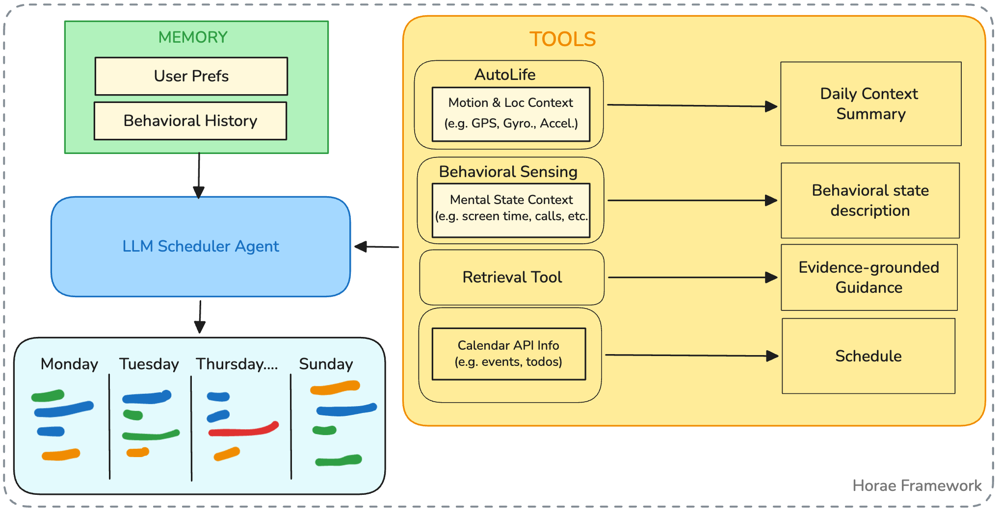

# Horae: A Behavior-Aware Agentic Scheduling Framework Grounded in Mobile Sensing

Code and paper artifacts for **Horae**, a behavior-aware agentic scheduling framework grounded in passive mobile sensing and behavioral-science evidence.

Horae studies how an LLM scheduler can use compact behavioral context, rather than raw phone streams or clinical labels, to make small calendar recommendations that respect user preferences and fixed obligations. The system combines mobile sensing summaries, personalized behavioral-state inference, evidence retrieval, calendar context, and memory into a scheduler-facing tool pipeline.



## Paper Context

This repository supports a work-in-progress systems paper on agentic scheduling with passive mobile sensing. The paper evaluates two questions:

1. Whether passive phone-derived markers can be summarized into meaningful, personalized behavioral states.
2. Whether those states can change downstream schedule recommendations in a controlled end-to-end simulation.

The checked-in artifacts are intended to make the paper claims inspectable: StudentLife validation summaries, latent simulation logs, payload-size measurements, focused tests, and framework source code are kept together with the scripts that produced them.

## Repository Contents

- `wellbeing_pipeline/`: layered behavioral sensing pipeline, StudentLife analyses, latent simulation, payload-size measurement, and stored paper artifacts.
- `tools/`: scheduler tools for wellbeing sensing, AutoLife journal parsing, calendar context, feedback, and retrieval.
- `agent.py`, `main.py`, `api.py`: prototype scheduler entrypoints and orchestration code.
- `autolife_android_client/`: mobile prototype source for passive sensing and daily context generation.
- `apps/mindful-rag/`, `vectordb/`: lightweight retrieval components used for behavioral-science guidance.
- `docs/`: framework documentation and the README figure.
- `tests/`: focused regression tests for the sensing pipeline and simulation logic.

## Paper Artifact Map

| Paper evidence | Local artifact |
| --- | --- |
| StudentLife circadian-rule comparison and descriptive alignment table | `wellbeing_pipeline/results/studentlife_validation_circadian_rule_compare_1f1dfb2.md` |
| StudentLife mixed-effects/random-intercept checks | `wellbeing_pipeline/results/studentlife_lmm_clustered_1f1dfb2_summary.md` |
| StudentLife construct/outcome supplemental summaries | `wellbeing_pipeline/results/studentlife_construct_outcomes_tight_circadian_1f1dfb2_summary.md` |
| Latent simulation aggregate metrics | `wellbeing_pipeline/simulation_outputs/latent/summary.json` |
| Latent simulation detection and restraint checks | `wellbeing_pipeline/simulation_outputs/latent/detection_sensitivity.json`, `wellbeing_pipeline/simulation_outputs/latent/normal_day_restraint.json` |
| Latent simulation blinded rater sheet and scored preferences | `wellbeing_pipeline/simulation_outputs/latent/rater_sheet_scored_with_arm.csv` |
| Payload-size comparison | `wellbeing_pipeline/simulation_outputs/payload_size/payload_size_report.json` |
| Behavioral sensing figures | `wellbeing_pipeline/figures/` |

## Quickstart

```bash
python3 -m venv .venv
source .venv/bin/activate
python -m pip install -r requirements.txt
python -m pytest tests/test_latent_simulation.py tests/test_wellbeing_pipeline.py tests/test_wellbeing_sensor.py
```

## Reproducing Analyses

StudentLife raw data must be obtained separately. To rerun StudentLife analyses, set:

```bash
export STUDENTLIFE_DATASET_ROOT=/path/to/studentlife/dataset
```

The stored StudentLife summaries are the canonical paper-branch outputs. They evaluate descriptive alignment with same-day self-reported stress, not causal wellbeing effects.

The latent simulation artifacts in `wellbeing_pipeline/simulation_outputs/latent/` use a fixed seed (`20260627`) with 20 synthetic participants over 42 days. Re-running `wellbeing_pipeline/latent_simulation.py` may make live model API calls unless a compatible local cache is supplied.

Payload-size summaries can be regenerated with:

```bash
python wellbeing_pipeline/measure_payload_sizes.py
```

## Claim Boundaries

Horae is a work-in-progress research prototype. The StudentLife analysis supports construct-validity style evidence for behavioral-state summaries; the simulation supports framework feasibility and recommendation-quality analysis. The repository does not establish deployed user benefit or clinical efficacy.

## Citation

Citation information will be added with the paper release.
