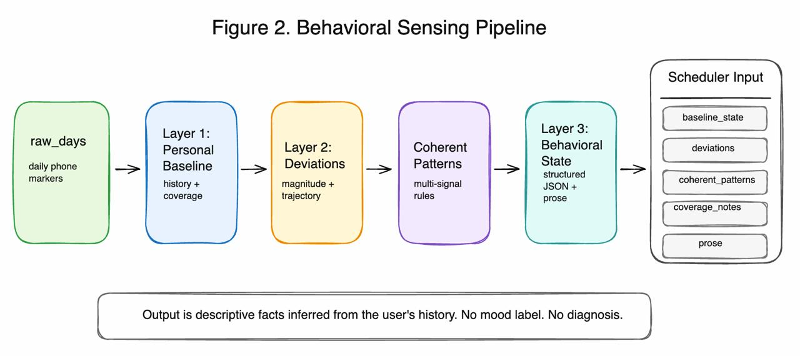

# Horae: Behavior-Aware Agentic Scheduling from Mobile Sensing

Horae is a work-in-progress research framework for adaptive scheduling. Instead of treating the calendar as context-free, Horae combines passive mobile sensing, journal context, calendar availability, user preferences, feedback memory, and behavioral-science retrieval to propose small, user-approved schedule adjustments.

The central idea is deliberately conservative: the phone does not predict mood or diagnose a user. It summarizes recent behavioral deviations relative to the user's own baseline, groups related deviations into interpretable behavioral states, and passes only that compact state to an LLM scheduler.

This repository contains the mobile sensing clients, FastAPI backend, wellbeing sensing pipeline, retrieval layer, scheduler agent, Google Calendar integration, and tests used to support the Horae MobiCom WiP paper.

## Research Framing

Modern scheduling tools usually treat a task the same regardless of whether the user recently shifted sleep later, narrowed mobility patterns, increased late-night phone use, or showed fragmented daily routines. Horae explores whether those behavioral shifts can become useful scheduling context without sending raw sensor streams to an LLM.

The paper makes three preliminary contributions:

1. A behavior-aware agentic scheduling framework that coordinates behavioral sensing, calendar/task context, user memory, and evidence retrieval.
2. A mobile sensing-to-state tool that converts passive phone-derived markers into personalized, multi-signal behavioral-state summaries.
3. Preliminary evidence that one state, behavioral withdrawal, aligns with same-day self-reported stress in StudentLife, where isolated single-marker deviations do not.

Horae should be read as feasibility and construct-validity work, not as a completed clinical or causal wellbeing intervention.

## System Overview



```text
Mobile client
  - Collects passive context signals
  - Aggregates raw streams into daily behavioral markers
  - Keeps raw GPS, motion, screen, and communication logs on device

FastAPI backend
  - Receives minimized daily marker payloads and journal summaries
  - Builds personalized baselines and behavioral-state descriptions
  - Retrieves behavioral-science guidance from ChromaDB
  - Generates schedule recommendations with an LLM scheduler
  - Returns signed, user-reviewable calendar proposals

Google Calendar integration
  - Reads upcoming schedule context through OAuth
  - Applies only user-selected proposals through /api/apply_calendar
  - Records accept/reject feedback for future personalization
```

## Privacy and Data Minimization

Horae uses a layered boundary between raw sensing and scheduling:

1. On-device collection: Android and iOS clients collect context signals locally. Raw sensor logs stay on the device.
2. Daily marker aggregation: the client summarizes raw streams into compact daily markers such as sleep duration, mobility entropy, location revisit ratio, screen use, and social rhythm coverage.
3. Behavioral state construction: the backend compares recent marker windows against the user's rolling baseline and emits descriptive states, not diagnoses.
4. Scheduler prompting: the LLM receives behavioral-state summaries, calendar context, preferences, feedback history, and retrieved research snippets. It does not receive raw location traces or raw sensor streams.

The paper reports that a full day's behavioral state serializes to about 1.9 KB versus about 710 KB/day of logged StudentLife sensor records, a roughly 377x reduction before gzip.

## Behavioral Sensing Pipeline

The sensing pipeline is deterministic through the state-description layer:


1. Layer 1: personal baselines over daily markers.
2. Layer 2: recent-window deviation detection against the user's own rolling baseline.
3. Layer 3: structured and prose behavioral-state summaries.
4. Layer 4: optional scheduler-facing LLM reasoning over the state, calendar, preferences, and feedback history.

Current marker families:


| Domain | Markers |
| --- | --- |
| Sleep | `sleep_onset_hour`, `sleep_duration_hours`, `sleep_regularity_index` |
| Screen | `late_night_screen_min`, `total_screen_min`, `app_switching_rate` |
| Mobility | `mobility_entropy`, `location_revisit_ratio` |
| Routine/social rhythm | `social_rhythm_metric`, `comm_reciprocity` |

Current coherent states:

| State | Required signal pattern |
| --- | --- |
| Phone-mediated sleep delay | Later sleep onset plus elevated late-night screen use |
| Behavioral withdrawal | Reduced mobility entropy plus narrowed location routine |
| Circadian instability | Lower sleep regularity, optionally with delayed sleep/social rhythm shifts |
| Fragmented attention with sleep loss | Elevated app switching plus reduced sleep duration |

## Preliminary Evaluation

### StudentLife behavioral-state validation

Horae was evaluated on StudentLife, a 10-week study of 48 students with passive phone sensing and repeated self-reports. After warmup and coverage filtering, the analysis covers 1,132 participant-days with same-day scalar stress reports across 46 participants.

The validation question is not whether Horae predicts stress. The question is whether composite behavioral states carry more meaningful signal than simpler sensing summaries.

| Representation | Same-day stress | p-value | Effect size |
| --- | ---: | ---: | ---: |
| Single-marker deviation | 1.81 vs 1.82 | 0.91 | approximately 0 |
| Graded severity index | 1.90 vs 1.76 | 0.03 | 0.13 |
| Any multi-signal state | 2.11 vs 1.80 | 0.017 | 0.29 |
| Behavioral withdrawal | 2.43 vs 1.80 | 0.002 | 0.61 |

Behavioral withdrawal also remains significant under a participant random-intercept model. The other current states were too infrequent in StudentLife to validate individually, so they should be treated as not-yet-validated rather than proven.

### End-to-end scheduling simulation

The paper also reports a synthetic longitudinal simulation with 20 participants over 42 days each. The behavior-aware arm receives calendar, preferences, and inferred state; the calendar-only arm receives calendar and preferences without behavioral state.

Key findings:

- State detection reached 68% of episode days overall and 81% for behavioral withdrawal.
- On normal days, behavior-aware scheduling intervened less than the calendar-only baseline: 7.1% vs 12.4% high-burden changes.
- On detected days, behavior-aware scheduling better preserved fixed and flexible commitments: 87% vs 78%.
- A blinded LLM rater preferred behavior-aware recommendations in 72% of cases. This is treated only as a sanity check because it is an LLM judging LLM output.

Important limitation: this is feasibility evidence, not deployed user-benefit evidence. The simulation uses synthetic participants and a single seed. Real behavioral impact requires a prospective field study.

## Implementation Status

| Area | Status |
| --- | --- |
| Android marker aggregation | Implemented for mobility, sleep proxies, screen/app usage, social rhythm, and communication reciprocity when permissions are available. |
| iOS marker aggregation | Implemented for mobility/social rhythm and HealthKit sleep. Screen-time and communication reciprocity are intentionally absent because iOS restricts those APIs without major UX or privacy tradeoffs. |
| FastAPI backend | Implemented with `/api/process_journals`, OAuth endpoints, `/api/apply_calendar`, enrollment logging, validation, and JSON error handling. |
| Wellbeing sensing | Implemented in `wellbeing_pipeline/` and exposed through `tools/wellbeing_sensor.py`. |
| Scheduler agent | Implemented in `agent.py`, combining journal narrative, behavioral state, calendar context, research retrieval, memory, and feedback history. |
| Calendar application | Implemented as signed, user-selected proposals; Google Calendar writes happen only after explicit apply. |
| Research retrieval | Implemented with ChromaDB and Gemini embeddings. The paper describes a 61-item behavioral-science library; the checked-in source-PDF seed set and embedded Chroma collections should be audited before artifact submission to ensure the packaged index matches the paper. |
| Battery/pilot assessment | In-app battery assessment workflow is documented for IRB/pilot readiness. Empirical device results should be filled in before claiming minimal battery impact. |
| Real-user impact | Not yet evaluated. Planned multi-week deployment and IRB workflow are future work. |

## Repository Layout

```text
.
|-- api.py                         # FastAPI server, OAuth, auth, proposal signing
|-- agent.py                       # LLM Scheduler Agent orchestration
|-- tools/
|   |-- wellbeing_sensor.py        # Backend entry point for Layer 1-4 sensing
|   |-- llm_client.py              # Gemini scheduling/recommendation prompts
|   |-- vectordb_client.py         # ChromaDB research retrieval
|   |-- calendar_api.py            # Google Calendar and Tasks integration
|   `-- wellbeing_feedback.py      # Accept/reject/modify/no-show feedback
|-- wellbeing_pipeline/
|   |-- layer1.py                  # Marker schema and personal baselines
|   |-- layer2.py                  # Deviations and coherent state rules
|   |-- layer3.py                  # Structured/prose state descriptions
|   |-- layer4_llm.py              # Optional scheduler-facing LLM call
|   |-- studentlife_adapter.py     # StudentLife feature adapter
|   |-- evaluate_studentlife.py    # Retrospective validation workflow
|   `-- synthetic.py               # Synthetic participant generator
|-- autolife_android_client/
|   |-- composeApp/                # Compose Multiplatform shared UI and platform actuals
|   |-- androidApp/                # Android host app and background service
|   |-- iosApp/                    # iOS host app and native service wrappers
|   `-- shared/                    # Shared data models and storage code
|-- vectordb/                      # ChromaDB artifacts, ingestion scripts, source papers
|-- app-context/                   # Architecture, API, UI, and data-model documentation
|-- tests/                         # Backend and pipeline tests
`-- output/horae_mobicom_wip/      # Current WiP paper PDF/source artifact
```

## Quick Start

### Backend

```bash
pip install -r requirements.txt
uvicorn api:app --reload
```

Required environment variables depend on which integrations you run:

```bash
export GEMINI_API_KEY=...
export API_SECRET_KEY=...
export GOOGLE_CREDENTIALS_JSON=...   # for OAuth deployment
export DATABASE_URL=...              # optional Postgres logging
```

### Android client

```bash
cd autolife_android_client
./gradlew :composeApp:compileDebugKotlinAndroid
```

For local Android development, add API keys and the backend URL to `local.properties`:

```properties
GEMINI_API_KEY=your_gemini_key
MAPS_API_KEY=your_maps_key
BACKEND_URL=http://10.0.2.2:8000
```

Use a physical device for realistic sensing and battery checks.

### Tests

```bash
pytest
```

Focused checks:

```bash
pytest tests/test_wellbeing_sensor.py
pytest tests/test_api.py
pytest tests/test_llm_client.py
```

## Reviewer Notes

Horae is intentionally not framed as a clinical diagnosis or direct stress predictor. Its output is behavioral context for scheduling.

The strongest validated construct so far is behavioral withdrawal. Other coherent states are implemented and literature-grounded, but need more data for individual validation.

The mobile and backend system support user-approved calendar writes, but the paper's quantitative scheduling results are from synthetic simulation, not a deployed intervention.

The full artifact package should ensure the retrieval corpus, ChromaDB index, and README all report the same evidence-library size before external review.

## Citation

```bibtex
@inproceedings{aripineni2026horae,
  title={Horae: A Behavior-Aware Agentic Scheduling Framework Grounded in Mobile Sensing},
  author={Aripineni, Sanskriti and Simhadri, Rishi Nandan and Tran, Khao and Srinivasachari, Lakshana and Yan, Xiao and Ding, Yi},
  booktitle={Proceedings of the ACM MobiCom Work-in-Progress (WiP) Track},
  year={2026}
}
```
