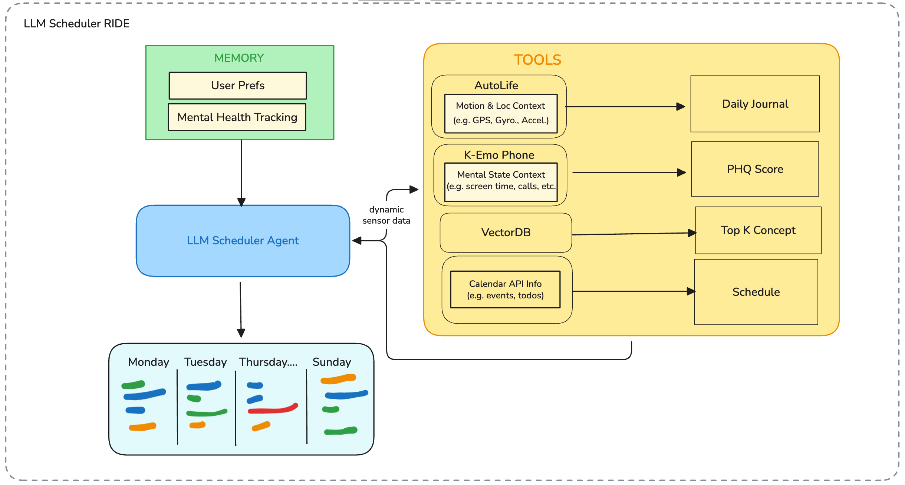
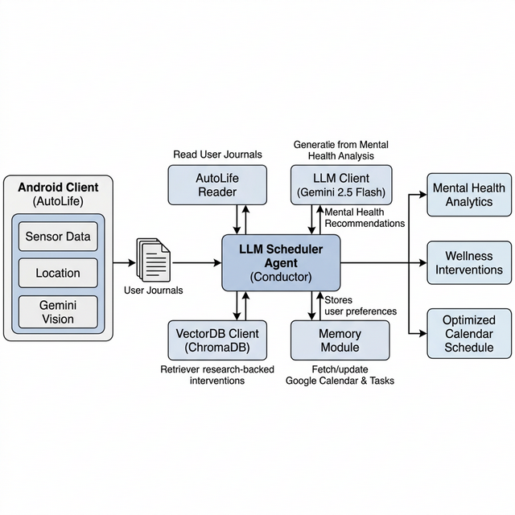

# Framework Rishi

## Overview
Multi-agent LLM framework integrating AutoLife data collection with a three-layer wellbeing sensing pipeline and calendar integration.

The Python backend orchestrates journal analysis, behavioral sensing (Layer 1–4 of `wellbeing_pipeline/`), research-backed interventions, and calendar suggestions. The Android client under `autolife_android_client/` handles on-device sensing and journal generation.

## LLM Scheduler RIDE Architecture



## Project Structure




```text
framework_rishi/
├── autolife_android_client/   # Android app for AutoLife data collection/journaling
├── tools/                     # Core agent tools
│   ├── autolife_reader.py     # Parses generated journals
│   ├── wellbeing_sensor.py    # Three-layer behavioral sensing pipeline
│   ├── autolife_phone_adapter.py  # Derives sensor markers from journals
│   ├── vectordb_client.py     # Fetches Top K concepts
│   ├── wellbeing_feedback.py  # Records accept/reject feedback
│   └── calendar_api.py        # Calendar integration
├── wellbeing_pipeline/        # Layer 1–4 baselines, deviations, LLM synthesis
├── data/                      # Storage for logs and feedback
├── main.py                    # Entry point
└── agent.py                   # Core agent logic (conductor)
```

## Android Client Status

The Android client in `autolife_android_client/` is not missing. It is already present and substantially implemented.

Implemented:
- Motion sensing and classification using accelerometer, step counter, pressure (altitude), and GPS speed (`MotionDetector.kt`).
- Wi-Fi + map-based location context inference (`WifiScanner.kt`, `LocationAnalyzer.kt`, `MapImageProvider.kt`).
- Gemini-based text and vision prompting (`GeminiClient.kt`).
- Background duty-cycled collection and periodic journaling (`AutoLifeService.kt`, `JournalGenerator.kt`).
- Room persistence for logs and journal entries (`data/AppDatabase.kt`).

Current behavior:
- Analysis loop interval: 1 minute (`LOG_INTERVAL = 60_000ms`).
- Motion collection window per cycle: 15 seconds (`MOTION_DURATION = 15_000ms`).
- Journal generation interval: 15 minutes (2 minutes in demo mode).

Notes:
- `ContextFusionAnalyzer.kt` exists and is wired in the sequential analyzer, but the background service path currently finishes after motion+location logging for efficiency.
- Journal generation uses stored logs over a time window and prompts Gemini for concise, objective summaries.

## Branch Alignment Note

Comparison against `autolife_rishi` shows:
- `autolife_rishi/app/...` and `framework_rishi/autolife_android_client/app/...` were migrated with matching source modules.
- This branch includes one service-loop fix: removed a duplicated `startAnalysisCycle()` call in `AutoLifeService.kt`.
- No full client replacement from `autolife_rishi` is required.
- Main differences are Gradle wrapper artifacts/scripts and repository layout (root Android project vs nested `autolife_android_client/`).

## Setup

### Python Framework

1. Install dependencies:
```bash
pip install -r requirements.txt
```

2. Configure credentials as needed.

3. Run:
```bash
python main.py
```

### Android Client (`autolife_android_client`)

1. Open `autolife_android_client/` in Android Studio.
2. Add API keys to `local.properties`:
```properties
GEMINI_API_KEY=your_gemini_key
MAPS_API_KEY=your_maps_key
# Optional: override backend URL for physical devices (default targets Android emulator loopback)
# BACKEND_URL=http://192.168.x.x:8000
```
3. Build and run on a physical Android device.
4. Grant permissions for location, activity recognition, and notifications.
